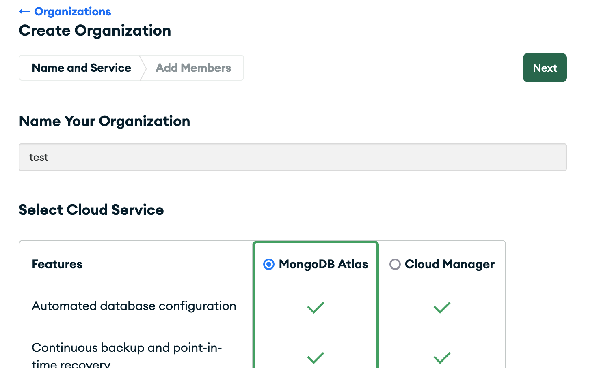
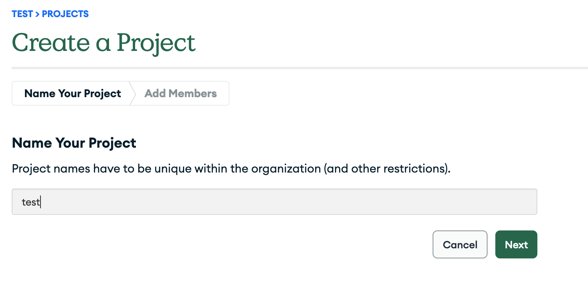
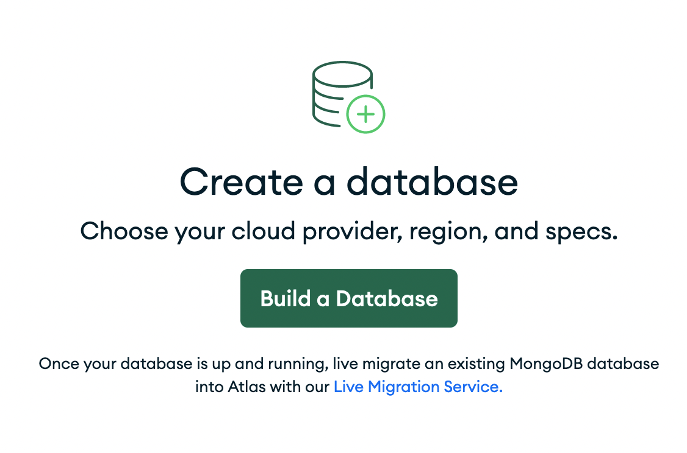
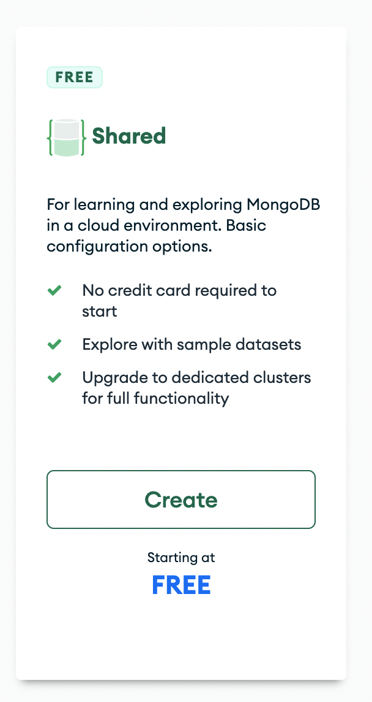
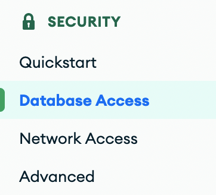
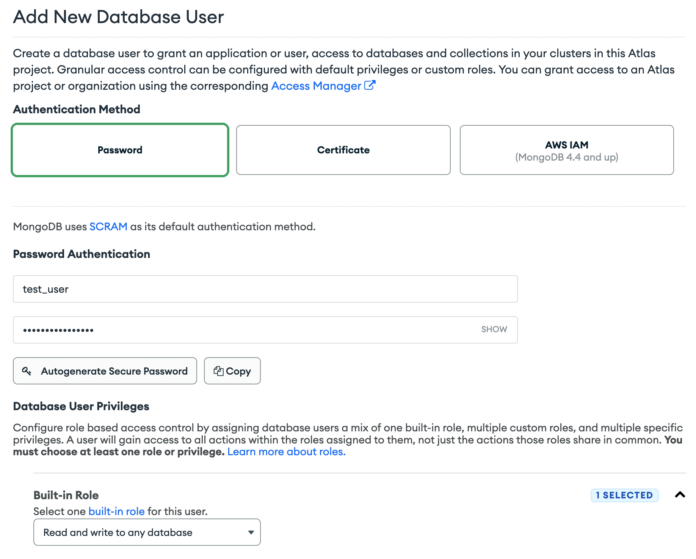

# Tutorial: Create a database from scratch
> Index DICOM metadata in a MongoDB instance

## Overview
In this tutorial, you will create a database from scratch and add the metadata from 1693 public DICOM images.

In summary this is what you will do:
1. Download public DICOM data from TCIA.
2. Create a free MongoDB Atlas Cluster.
3. Ingest the metadata from the DICOM files into the database.

## 1. Download public DICOM data.
You will download the _pseudo-PHI_ dataset from TCIA that has been published in [A DICOM dataset for evaluation of medical image de-identification](https://www.ncbi.nlm.nih.gov/pmc/articles/PMC8285420/).

1.1 To do so, let's first install the _NBIA Data Retriever_ by following [these instructions](https://wiki.cancerimagingarchive.net/display/NBIA/Downloading+TCIA+Images).

1.2 Then we obtain the `(DICOM, 609 MB) Evaluation dataset` manifest by downloading the first item of [pseudo-PHI](https://wiki.cancerimagingarchive.net/pages/viewpage.action?pageId=80969777).

1.3 The next step is to open the file that you just obtained (`Pseudo-Phi-DICOM Evaluation dataset April 7 2021.tcia`) with the _NBIA Data Retriever_

1.4 Then click on the "Browse" button and select a suitable folder in your computer.
From now on we will refer to this folder as `/path/to/pseudo-PHI` you will have to replace it with the location where you want to download the data.

1.5 Finally click `Start`.
You should see a screen like this:


Congratulations, now you have 1693 dicom files in your local.

## 2. Create a free MongoDB Atlas Cluster
This step allows us to headstart the ingestion without having to set up a local database.

2.1 Go to [Atlas](https://www.mongodb.com/atlas) and click the `Try Free` button.
This will take you through a Sign-up process. After you are done creating your account,
you may be asked to create an organization. If an organization is already present, you
can skip this step and go directly to creating the project (2.2). When you create the
organization, you should name it and pick the *MongoDB Atlas* feature.



2.2 Then create a project.



2.3 You can now start the creation of the database by clicking on `Build a Database`.



Make sure to select the Free Tier



To keep the free tier, you will need to keep the default settings. Go ahead and create the cluster.


2.4 After the cluster is created, navigate to the __Database Access__ tab.



2.5 And __Add new database user__


2.6 Configure the username as `test_user` and create the password with __Autogenerate Secure Password__. Make sure to copy the password as it will be used in a later step.
From now on we will refer to this generated password as `your_mongodb_pass`.

2.7 Select the Built-in Role `Read and write to any database`



2.8 Finally get the host address of your database
- On the left menu, go to `Database`
- Click `Connection`
- Go to connect your application
- Copy the string that looks like `cluster...net` and save it so you can use it in the
  next steps.

## 3. Ingest the metadata from the DICOM files into the database
It is now time to use the `cobra_db` package to ingest the files.

```{important}
Python 3.9 or above is a requirement for this step. Depending on you OS, there are multiple ways to
install python. An opinionaned method, is by first installing [Miniconda](https://docs.conda.io/en/latest/miniconda.html) and then creating a conda environment as shown below.
```

(optional) 3.1 Following best practices, you can create a python environment:
```bash
conda create -n cobra python=3.9 -y
# after the enviroment is created
conda activate cobra
```

3.2 Then install the cobra_db package from pypi

```bash
pip install cobra_db
```

3.3 The password for the database will be read from the environmental variables. Export
it by running the following command (replacing with the password that was generated in
step 2)

```{tip}
If your password contains special characters or spaces, single quotes must surround your
password.
```

```
 export MONGOPASS='your_mongodb_pass'
```

3.4 Now prepare a text file called `ingest_my_data.sh` where you replace the path to
your downloaded data and your cluster host.

```{important}
Remember to replace the values that are surrounded by `< ... >` with the settings
obtained from previous steps (1.4 and 2.8). The characters `< >` should not exits in
your file.
```

```bash
cobra_ingest \
    --drive_names PseudoPHI \
    --drive_paths </path/to/pseudo-PHI> \
    --host <cluster...mongodb.net> \
    --username test_user \
    --database_name my_tutorial_0 \
    --num_processes 1 \
    --project_name test_project
```

```{tip}
You can increase the --num_processes to make use of multiple CPUs. Just remember to keep
it below the number of CPUs that your system has available.
```

3.5 You can now run the ingestion with

```bash
bash ingest_my_data.sh
```

3.6 If everything worked correctly, you should be able to see a progress status in the
terminal. It will be done in about 3 minutes if you selected only one process.

3.7 Let's now install [Compass](https://www.mongodb.com/try/download/compass) to see the
results of the ingestion.

3.8 In compass enter your credentials and connect to your Atlas instance. This can be done
by using a string similar to `mongo+srv://test_user:<password>@<host>/test` where you replace
the password and host with the settings that you obtained in steps 1.4, and 2.6.

Under my_tutorial_0/ImageMetadata you should be able to see all the metadata of the
images that you just downloaded.


```{attention}
Notice how the dicom tags have been stored as key-value pairs and that we have replaced
the tags with keywords to improve readability.
```

Congratulations on finishing the first tutorial! Now you can explore the ImageMetadata
collection with your own queries and aggregations.


# Tutorial: Group Series, Studies, and Patients.

This tutorial builds on top of the first tutorial. You will group the images that were previously ingested to obtain three new collections:
RadiologicalSeries, RadiologicalStudy, and Patient.

First, create a text file called `group_my_data.sh` with the following content:

```bash
cobra_group \
    --host <your_db_host>.mongodb.net \
    --username test_user \
    --database_name my_tutorial_0 \
    --num_processes 1 \
    --project_name test_project
```

Then run it
```bash
bash group_my_data.sh
```

```{note}
If you are using Compass to look at the data you might need to reload in order to see
the new collections.
```

In this case, we are only allowing the Modalities in `cobra_db.enums.Modality` to be grouped, everything else is ignored.

Congratulations! you have now three new collections that summarize the images at different
aggregation levels.
